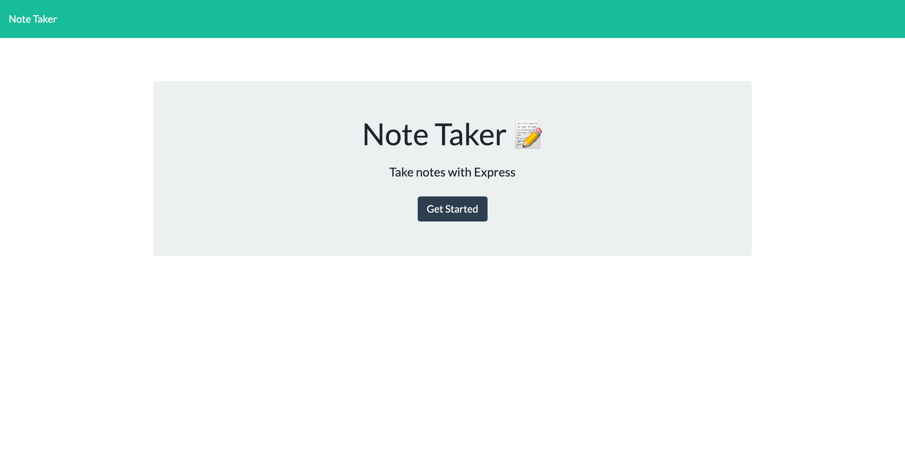
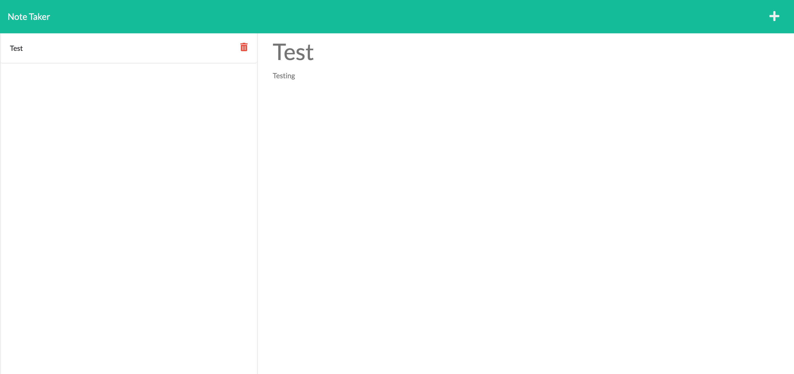

# note taker

## Description

This is a Note Taker application that uses Node.JS and Express.JS.

The note taker will start off blank and you can create a title for your note/reminder and then enter the text underneath. Once your note is made you can save it and it will be stored in a list on the left side of the webpage. You can view your notes again by clicking in the list on the title of the note you would like to view. There is also a functional delete button that will let you delete your notes from the database.

## Screenshot

## Links to Application

- Here is the link to the repo: [smarr2198/repo](https://github.com/smarr2198/noteTaker)
- Here is the link to the deployer Heroku page: [smarr2198/heroku](https://note-taker-smarr2198.herokuapp.com/notes)
